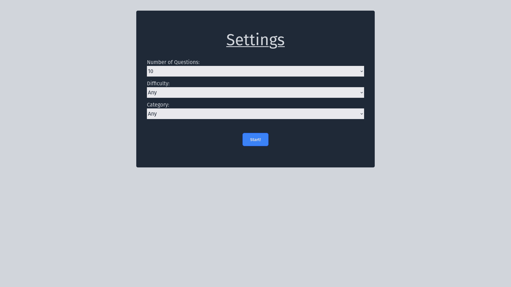
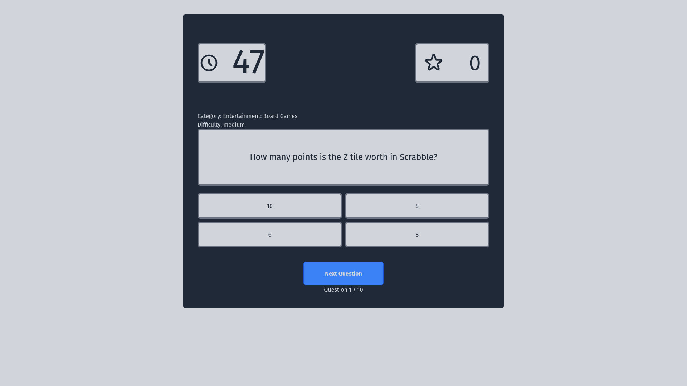
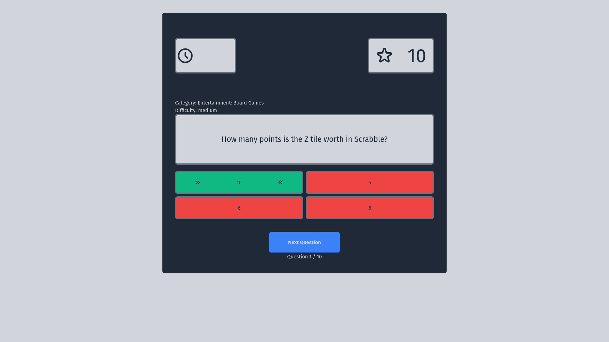
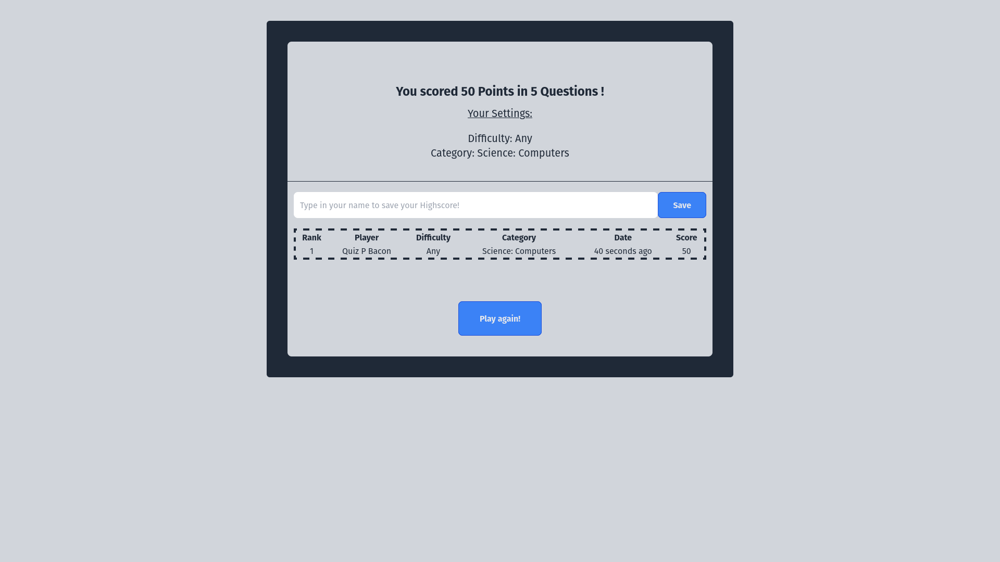

# Trivia-API Quiz

### Who doesn't like to quiz?

I have made a little quiz site, which uses the Open-Trivia-API. On start, you can select how many questions you want to be asked, what difficulty and from which category you want the questions to be.
Alternatively you can let the API decide on the difficulty and the category for each question.
When you hit "Start!", you have 60 seconds for each question to answer. You get points for every right answer and for every wrong answer (or for every question you don't answered) you will get points deducted.
When you have gone through all question, you might type in a playername and compare yourself to others on the local highscore board.

## Technologies I have used:
---
- Laravel
- Laravel Livewire
- Alpine.js
- Tailwind-CSS
- MariaDB

## Screenshots
---

### Quiz Settings


### Question


### Answer


### Highscores



## Requirements:
---
- composer
- mariadb
- php7.3 or higher

#### OR
- composer
- docker

## Installation
---
- clone repository to your harddrive:
```
clone https://github.com/jedi-mind/trivia-quiz.git
```
- change directory to trivia-quiz:
```
cd trivia-quiz
```
- create .env file:
```
cp .env.example .env
```
- create application key:
```
php artisan key:generate
```
- install dependencies:
```
composer install
```

#### with docker/sail:
- install sail:
```
php artisan sail:install
```
--> select mariadb [2]
- start the docker container:
```
./vendor/bin/sail up -d
```
- migrate the database:
```
./vendor/bin/sail migrate:fresh
```
- when you are done playing, stop the container:
```
./vendor/bin/sail down
```

#### without docker:
- migrate the database:
```
php artisan migrate:fresh
```
